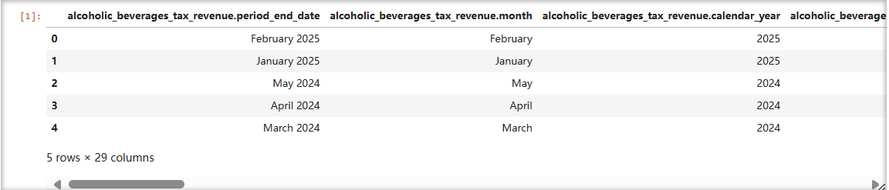

# DATA-MANAGEMENT STQD6324 Assignment 1-P149793  
## 1.Data Introduction  
  This dataset comes from USA OPEN DATA, which provides data on alcoholic beverage taxation in Connecticut. The dataset contains alcoholic beverage taxes from January 2020 to February 2025. There are 29 columns and 62 rows of data in total. The categories included are Malt Beverages, Cider, Wines, and Distilled Spirits, and each category is divided into different subcategories.  
  
## 2.Data Cleaning  
    
  By checking the data, there are no missing values ​​in the dataset.  
## 3.Data Visualization and Analysis  
    
  Alcohol tax revenue in each year shows different monthly fluctuation characteristics, with tax revenue in June 2023 being particularly prominent, reflecting the impact of seasonal or special factors on alcohol tax in different years. Since there is no data from March 2025 onwards in the dataset, the curve for 2025 is followed by zeros.  
    
  The proportion of distilled spirits in alcohol tax continues to grow, and their dominance becomes more and more prominent; the tax share of malt beverages and wine decreases year by year; the tax contribution of cider is negligible and has remained stable for a long time. This reflects that there are obvious differences in the contribution of different alcoholic beverages to alcohol tax, and the trend changes are significant.  
    
  Large wineries are the main source of wine tax, but their revenue is decreasing year by year; taxes on high-alcohol and sparkling wines are also on a downward trend; the tax contribution of small wineries is small and unstable.  
## 4.Data Prediction and Analysis  
### Prophet Model  
  Prophet is a time series forecasting tool open sourced by Facebook (now Meta), based on the additive model, designed to process time series data with seasonality (seasonality, cyclicality), holiday effects, and trend changes. It is robust to outliers and does not require complex data preprocessing. It is suitable for business scenarios (such as sales forecasting, user growth, resource requirements, etc.), especially for medium-frequency data (such as daily, weekly, and monthly data).  
### Visualization and Prediction Results
    
    
  The prophet model is used to predict the total tax revenue from March to December 2025. By analyzing the pictures, it is found that the tax revenue fluctuates greatly and there is no obvious stable trend, indicating that future tax revenue is affected by many uncertain factors and has high volatility and unpredictability.
## 5.Conclusion  
### Overall Tax Trend Analysis
  Tax revenue in 2020 was slightly lower than in other years, possibly due to the impact of the 2019 coronavirus pandemic. Overall tax fluctuations from 2021 to 2024 are minimal.  
### Tax Analysis by Category
  Malt Beverages account for about 10% to 17%. Cider accounts for about 0.2%. Wines account for about 12% to 16%. Distilled Spirits account for about 66% to 76%. And the proportion of Distilled Spirits is on the rise.  
### Suggestion
  Combine demographic or sales channel data to explore the underlying reasons for tax fluctuations. Launch promotions during the low tax periods to balance revenue throughout the year. Strengthen supervision of high-growth categories while supporting small-scale wineries.  
